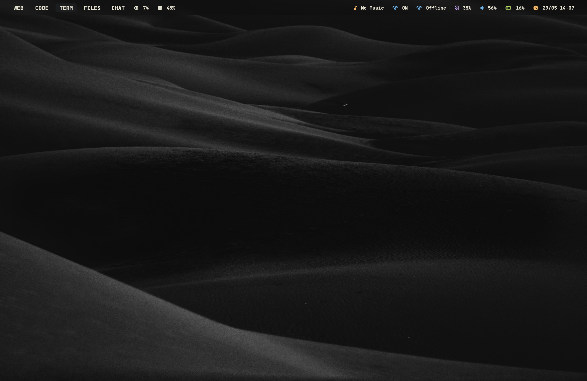

k# Ayu Mac Rice

A clean Ayu-themed macOS setup featuring:

* AeroSpace
* SketchyBar
* Ghostty
* Starship
* Fastfetch
* Spotify integration
* Tailscale status
* X-VPN status
* CPU, RAM, Disk, Battery and Volume indicators

---

## Installation

Clone the repository and run the installer:

```bash
git clone https://github.com/FuzzyGumnut/mac-rice.git

cd mac-rice

chmod +x install.sh

./install.sh
```

---

## What Gets Installed

The installer automatically installs:

* AeroSpace
* SketchyBar
* Ghostty
* Starship
* Fastfetch
* Borders
* JetBrainsMono Nerd Font

It also copies all included configuration files into the correct locations.

---

## Required After Installation

Open:

```text
System Settings → Privacy & Security → Accessibility
```

Enable:

* AeroSpace
* SketchyBar

You may need to log out and back in after granting permissions.

---

## Optional Applications

Install these for full functionality:

* Spotify (Music Widget)
* Tailscale (Tailscale Status Widget)
* X-VPN (VPN Status Widget)
* Raycast

---

## Updating

To update to the latest version:

```bash
cd ~/mac-rice

git pull

./install.sh
```

---

## Included Features

### SketchyBar

* Ayu Dark Theme
* Music Widget
* X-VPN Status
* Tailscale Status
* Disk Usage
* Volume
* Battery
* Clock
* CPU Usage
* RAM Usage
* Current App Indicator

### AeroSpace Workspaces

* WEB
* CODE
* TERM
* FILES
* CHAT
* MEDIA
* NET
* VM
* MISC
* SYS

### Terminal

* Ghostty
* Starship Prompt
* Fastfetch
* JetBrainsMono Nerd Font

---

## Notes

If AeroSpace does not start immediately after installation, log out and back in.

If icons appear as squares or missing symbols, ensure JetBrainsMono Nerd Font is installed and selected in Ghostty.

The installer does not install Spotify, Tailscale, X-VPN, or Raycast automatically.

