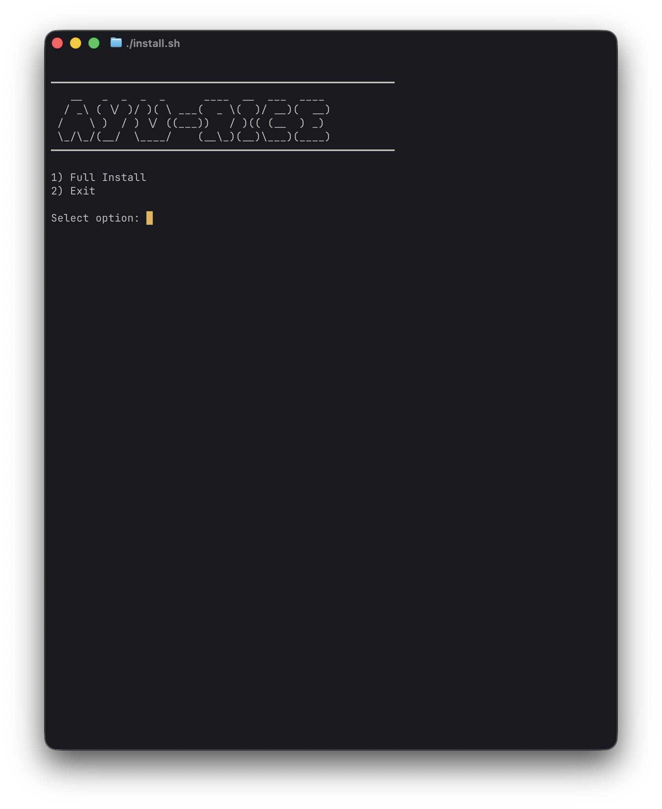
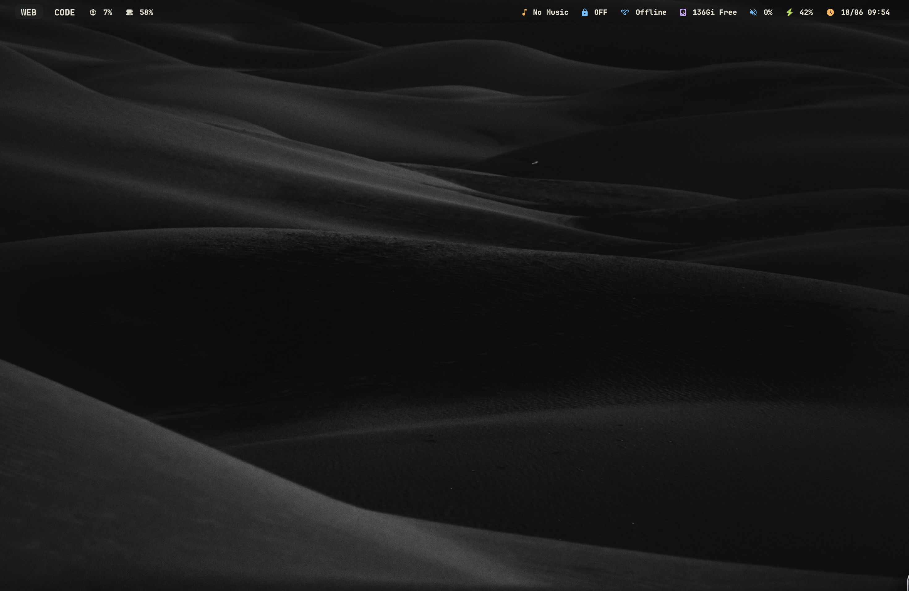

# Ayu Mac Rice
<p align="center">
  
</p>


A minimal Ayu-themed macOS rice built around AeroSpace, SketchyBar and Ghostty.

---

## Features

* AeroSpace Tiling Window Manager
* SketchyBar Ayu Theme
* Ghostty Terminal
* Starship Prompt
* Fastfetch
* btop
* Borders
* Obsidian
* JetBrainsMono Nerd Font
* Spotify Integration
* Tailscale Status
* X-VPN Status
* Animated Installer Intro
* Automatic Wallpaper Setup
* Automatic Screenshot Folder Setup
* Minimal macOS Tweaks

---

## Installation

Clone the repository and run the installer:

```bash
git clone https://github.com/FuzzyGumnut/mac-rice.git

cd mac-rice

chmod +x install.sh
chmod +x uninstall.sh


./install.sh
```

---

## What Gets Installed

The installer automatically installs:

* AeroSpace
* SketchyBar
* Ghostty
* Starship
* Fastfetch
* btop
* Borders
* Obsidian
* JetBrainsMono Nerd Font

It also:

* Copies all configuration files
* Sets the included wallpaper
* Creates a dedicated Screenshots folder
* Hides the Dock
* Hides the macOS Menu Bar
* Hides Desktop Icons
* Disables Recent Apps in the Dock
* Speeds up macOS animations
* Restarts Finder and Dock
* Starts SketchyBar services
* Starts Borders
* Applies AeroSpace configuration
* Includes an animated installer intro

---

## Required After Installation

Open:

```text
System Settings → Privacy & Security → Accessibility
```

Enable:

* AeroSpace
* SketchyBar

Open:

```text
System Settings → Privacy & Security → Screen Recording
```

Enable:

* Borders

You may need to log out and back in after granting permissions.

---

## Optional Applications

During installation you can choose to install:

* Spotify
* Tailscale
* Raycast

These applications are optional and can be skipped.

---

## Updating

To update to the latest version:

```bash
cd ~/mac-rice

git pull

./install.sh
```

---

## Uninstalling

To completely remove Ayu Mac Rice and restore most macOS changes:

```bash
git clone https://github.com/FuzzyGumnut/mac-rice.git

cd mac-rice

chmod +x install.sh
chmod +x uninstall.sh


./install.sh

# and select uninstall
```

The uninstaller will:

* Remove AeroSpace
* Remove SketchyBar
* Remove Borders
* Remove Ghostty
* Remove Starship
* Remove Fastfetch
* Remove btop
* Remove Obsidian
* Remove JetBrainsMono Nerd Font
* Remove Ayu configuration files
* Restore Dock visibility
* Restore Menu Bar visibility
* Restore Desktop Icons
* Restart Finder and Dock

A logout/login is recommended after uninstalling.


## Included Features

### SketchyBar

* Ayu Dark Theme
* Music Widget
* Current App Indicator
* CPU Usage
* RAM Usage
* Disk Usage
* Battery Status
* Volume Control
* Clock
* Network Status
* Tailscale Status
* X-VPN Status

### AeroSpace Workspaces

* WEB
* CODE
* TERM
* FILES
* CHAT
* MEDIA
* NET
* VM
* MISC
* SYS

### Terminal

* Ghostty
* Starship Prompt
* Fastfetch
* btop
* JetBrainsMono Nerd Font

### Applications

* Obsidian
* Spotify (Optional)
* Tailscale (Optional)
* Raycast (Optional)

### macOS Tweaks

* Auto-Hide Dock
* Auto-Hide Menu Bar
* Hidden Desktop Icons
* Included Ayu Wallpaper
* Dedicated Screenshot Folder
* Faster Window Animations
* Faster Mission Control Animations

---

## Notes

* Includes an animated startup intro (`ayu-intro`)
* Automatically applies the included wallpaper
* Automatically creates `~/Pictures/Screenshots`
* Borders requires Screen Recording permission
* AeroSpace may require a logout/login after installation
* If icons appear as squares, ensure JetBrainsMono Nerd Font is installed correctly
* Designed and tested on Apple Silicon Macs

---

## Screenshots

### Desktop

<p align="center">
  
</p>
